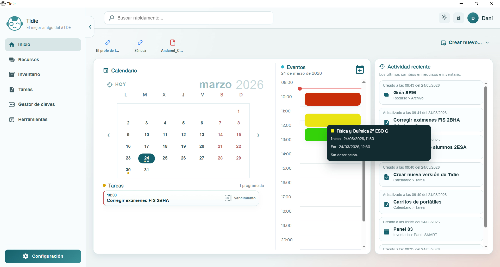
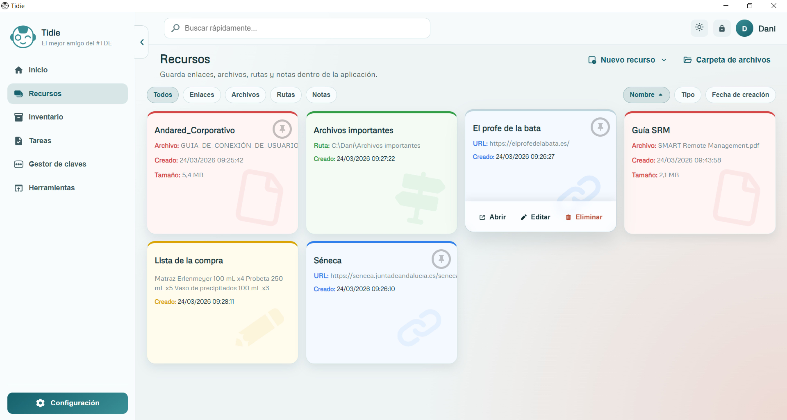
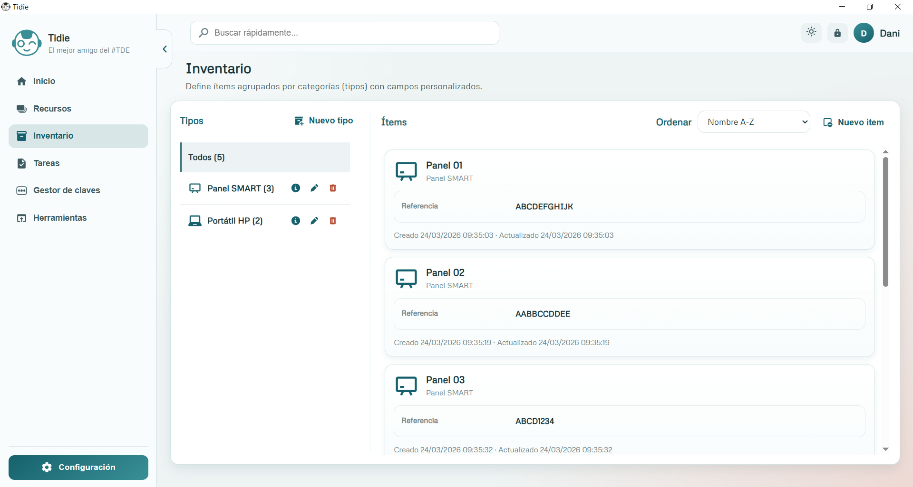
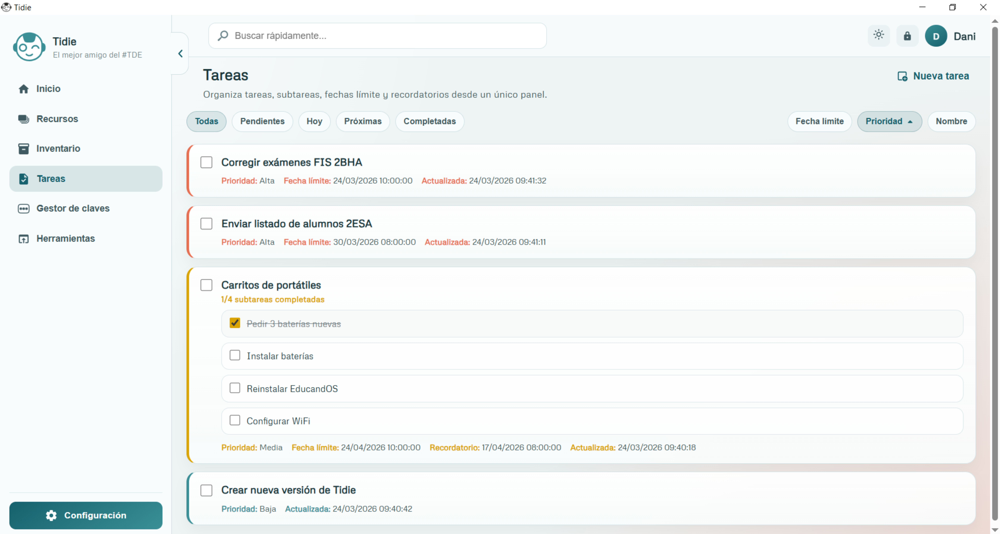
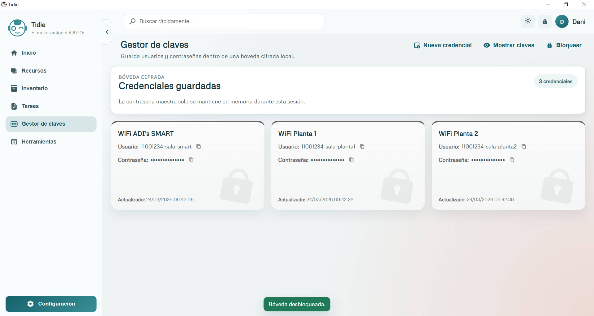
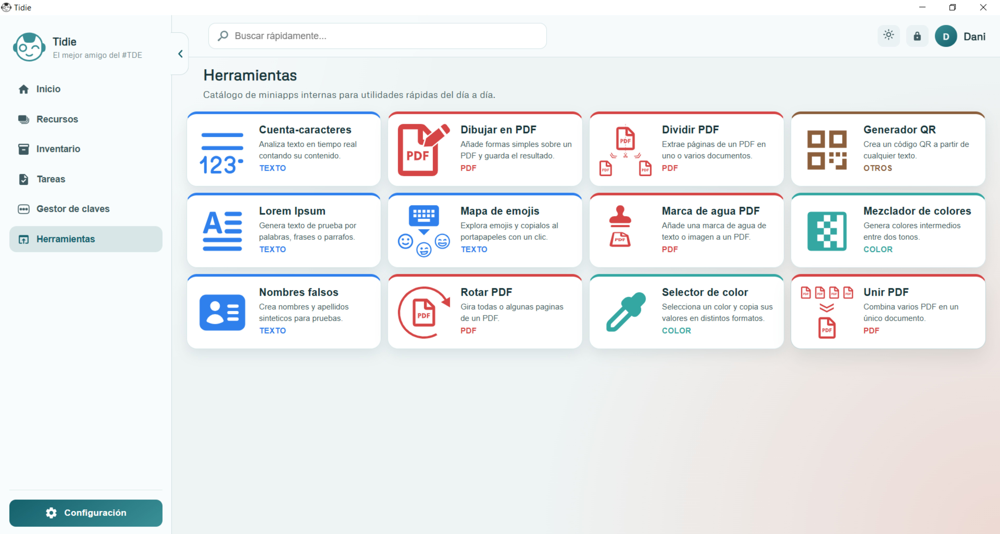
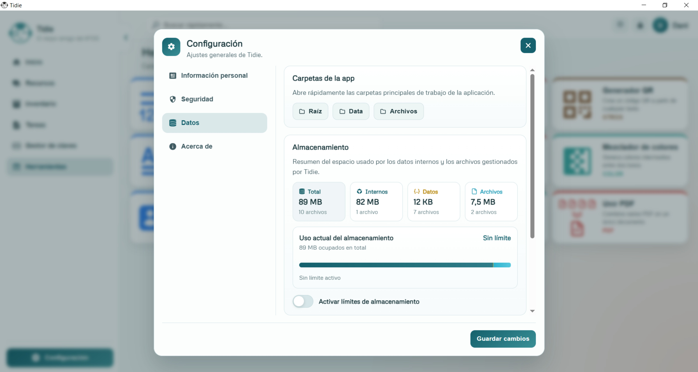
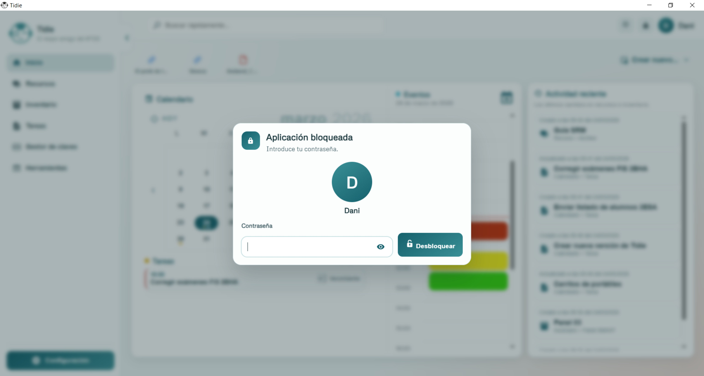
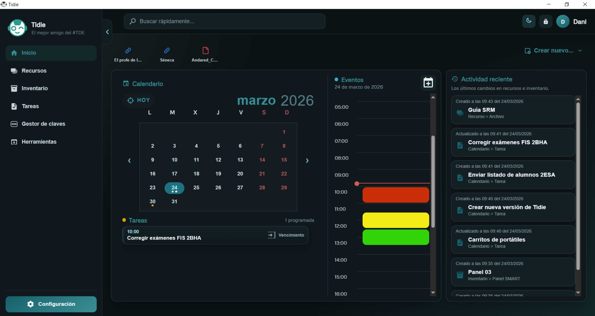

# Tidie

Repositorio público de distribución y versiones de **Tidie** para Windows.

Tidie es una aplicación de escritorio pensada para organizar el trabajo diario desde un único panel local. Reúne calendario, recursos, inventario, tareas, credenciales y herramientas rápidas dentro de una interfaz unificada.

## Qué incluye Tidie

- Calendario con eventos y tareas
- Gestión de recursos: enlaces, archivos, rutas y notas
- Inventario con tipos y campos personalizados
- Panel de tareas con recordatorios y vencimientos
- Bóveda local de credenciales
- Herramientas integradas para el día a día:
  - Cuenta-caracteres
  - Lorem Ipsum
  - Nombres falsos
  - Mapa de emojis
  - Generador QR
  - Selector de color
  - Mezclador de colores
  - Dibujar en PDF
  - Dividir PDF
  - Rotar PDF
  - Marca de agua PDF
  - Unir PDF

## Capturas

### Pantalla de inicio

### Pantalla Recursos

### Pantalla Inventario

### Pantalla Tareas

### Pantalla Gestor de claves

### Pantalla Herramientas

### Pantalla Configuración

### Bloqueo con contraseña

### Modo oscuro

## Descarga

Las versiones públicas de Tidie están disponibles en la sección **Releases** de este repositorio.

Descarga recomendada:
- `Tidie-Windows-v1.0.0.zip`

## Instalación

1. Descarga el archivo `.zip` desde **Releases**.
2. Extrae el contenido en una carpeta de tu elección.
3. Ejecuta `Tidie.exe`.

Importante:
- No ejecutes la aplicación directamente desde dentro del `.zip`.
- Mantén juntos el ejecutable y el resto de archivos de la carpeta distribuida.

## Datos de la aplicación

Tidie funciona en local.

Al ejecutarse, la aplicación crea su carpeta `data` junto al ejecutable para guardar:
- configuración
- calendario
- tareas
- inventario
- credenciales cifradas
- archivos gestionados por la app

Esto permite mover la carpeta completa de Tidie entre equipos o unidades manteniendo los datos.

## Aviso sobre Windows SmartScreen

Tidie no está firmada digitalmente en esta etapa del proyecto.  
Por ello, Windows puede mostrar advertencias al abrir la aplicación por primera vez.

Esto puede ocurrir especialmente cuando:
- la aplicación es nueva
- se descarga desde Internet
- todavía no tiene reputación suficiente para SmartScreen

## Sitio web oficial

https://elprofedelabata.es/

## Autoría

Tidie es un proyecto de **El profe de la bata**.

Desarrollado por **Dani García**.

## Estado del repositorio

Este repositorio está orientado a la **distribución pública** de versiones de Tidie.  
Las compilaciones publicadas se encuentran en **Releases**.

## Soporte

Si detectas un problema en una versión publicada, puedes abrir una incidencia en este repositorio o consultar la información publicada en la web oficial.
